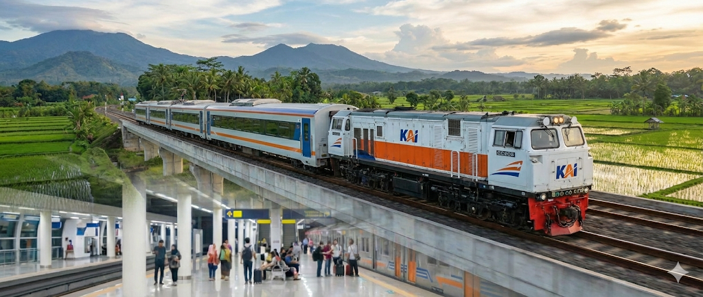
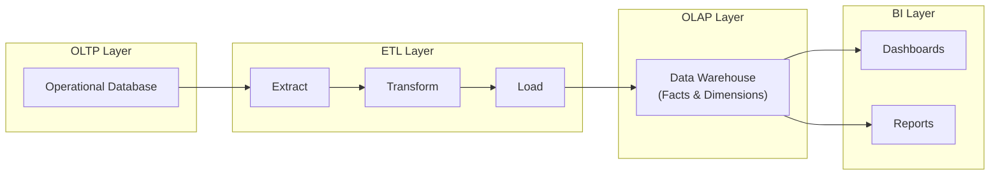

# KAI Data Warehouse

<figure>
  
  <figcaption>
    <i>
        Kereta Api Indonesia (KAI) — AI-generated image by Google Gemini.
    </i>
  </figcaption>
</figure>

A business intelligence case study that designs an OLTP-to-OLAP data warehouse
and analyzes railway performance using revenue and operational KPIs.

---
---

## Business Background

Railway transportation operators must balance revenue growth with operational efficiency and service reliability. This project simulates a real-world railway analytics scenario to help management evaluate financial performance, maintenance effectiveness, capacity utilization, and punctuality.

## Business Problems

The management of a railway operator faces several challenges:
- Fluctuating ticket revenue across routes and time periods
- Long repair times that disrupt operations
- Inefficient seat capacity utilization
- Service delays affecting customer satisfaction

## Key Performance Indicators (KPIs)

The following KPIs are used in this project:

1. **Total Ticket Revenue**  
   Measures overall income generated from ticket sales.

2. **Mean Time to Repair (MTTR)**  
   Evaluates maintenance efficiency by measuring average repair duration.

3. **Passenger Load Factor**  
   Indicates how effectively seat capacity is utilized.

4. **On-Time Performance (OTP)**  
   Measures the percentage of train trips arriving on schedule.

## Data Architecture Overview

The system follows a traditional BI architecture:

## Data Warehouse Design

The data warehouse uses a star schema optimized for analytical queries. For more detail how data warehouse design, you can open [design](design/) directory.

1. **Fact Tables**
- `FACT_TICKET_SALES` (transactional)
- `FACT_MAINTENANCE` (accumulating snapshot)
- `FACT_PASSENGER_LOAD` (periodic snapshot)
- `FACT_OPERATIONAL_PERFORMANCE` (accumulating snapshot)

2. **Dimension Tables**
- `DIM_DATE`
- `DIM_TRAIN`
- `DIM_ROUTE`
- `DIM_STATION`
- `DIM_COMPONENT`
- `DIM_PASSENGER`
- `DIM_TECHNICIAN`
- `DIM_PAYMENT_METHOD`
- `DIM_MAINTENANCE_TYPE`

## KPI Mapping

| KPI | Supporting Fact Table |
|---|-----------------------|
| Total Ticket Revenue | FACT_TICKET_SALES |
| Mean Time to Repair (MTTR) | FACT_MAINTENANCE |
| Passenger Load Factor | FACT_PASSENGER_LOAD |
| On-Time Performance (OTP) | FACT_OPERATIONAL_PERFORMANCE |

## BI Tools

ETL can be succeed with help tool by Pentaho. Analytical dashboards are created using Power BI to visualize KPI trends, comparisons, and performance indicators.

## Scope & Limitations

This project is a conceptual and educational case study. Data used in the warehouse may include synthetic or dummy data to demonstrate BI workflows.