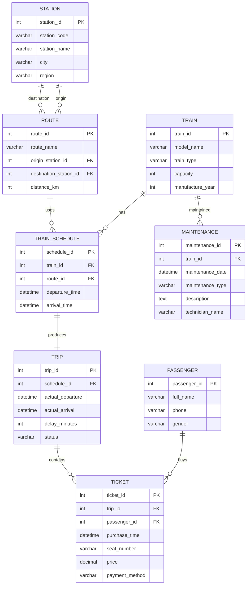

# OLTP

```mermaid
erDiagram
    TRAIN {
        int train_id PK
        varchar model_name
        varchar train_type
        int capacity
        int manufacture_year
    }

    STATION {
        int station_id PK
        varchar station_code
        varchar station_name
        varchar city
        varchar region
    }

    ROUTE {
        int route_id PK
        varchar route_name
        int origin_station_id FK
        int destination_station_id FK
        int distance_km
    }

    TRAIN_SCHEDULE {
        int schedule_id PK
        int train_id FK
        int route_id FK
        datetime departure_time
        datetime arrival_time
    }

    TRIP {
        int trip_id PK
        int schedule_id FK
        datetime actual_departure
        datetime actual_arrival
        int delay_minutes
        varchar status
    }

    PASSENGER {
        int passenger_id PK
        varchar full_name
        varchar phone
        varchar gender
    }

    TICKET {
        int ticket_id PK
        int trip_id FK
        int passenger_id FK
        datetime purchase_time
        varchar seat_number
        decimal price
        varchar payment_method
    }

    MAINTENANCE {
        int maintenance_id PK
        int train_id FK
        datetime maintenance_date
        varchar maintenance_type
        text description
        varchar technician_name
    }

    %% Relationships
    TRAIN ||--o{ TRAIN_SCHEDULE : has
    ROUTE ||--o{ TRAIN_SCHEDULE : uses
    TRAIN_SCHEDULE ||--|| TRIP : produces
    STATION ||--o{ ROUTE : origin
    STATION ||--o{ ROUTE : destination
    PASSENGER ||--o{ TICKET : buys
    TRIP ||--o{ TICKET : contains
    TRAIN ||--o{ MAINTENANCE : maintained
```

---

# OLAP

```mermaid
erDiagram

    %% =========================
    %% Dimension Tables
    %% =========================

    DIM_DATE {
        int date_id PK
        date date_value
        int day
        int month
        int quarter
        int year
        int week_of_year
        boolean is_weekend
    }

    DIM_TRAIN {
        int train_id PK
        varchar train_name
        varchar train_type
        int capacity
        int manufacture_year
    }

    DIM_ROUTE {
        int route_id PK
        varchar route_name
        int origin_station_id FK
        int destination_station_id FK
        int distance_km
    }

    DIM_STATION {
        int station_id PK
        varchar station_code
        varchar station_name
        varchar city
        varchar region
    }

    DIM_PASSENGER {
        int passenger_id PK
        varchar full_name
        varchar gender
        varchar age_group
    }

    DIM_PAYMENT_METHOD {
        int payment_method_id PK
        varchar method_name
    }

    DIM_COMPONENT {
        int component_id PK
        varchar component_name
        varchar category
    }

    DIM_MAINTENANCE_TYPE {
        int maintenance_type_id PK
        varchar type_name
    }

    DIM_TECHNICIAN {
        int technician_id PK
        varchar technician_name
        varchar skill_level
    }

    %% =========================
    %% Fact Tables
    %% =========================

    FACT_TICKET_SALES {
        int ticket_sales_id PK
        int date_id FK
        int train_id FK
        int route_id FK
        int passenger_id FK
        int payment_method_id FK
        int origin_station_id FK
        int destination_station_id FK
        int ticket_count
        decimal revenue
    }

    FACT_PASSENGER_LOAD {
        int passenger_load_id PK
        int date_id FK
        int train_id FK
        int route_id FK
        int trip_id
        int passenger_count
        int seat_capacity
        decimal load_factor
    }

    FACT_OPERATIONAL_PERFORMANCE {
        int operational_perf_id PK
        int date_id FK
        int train_id FK
        int route_id FK
        int origin_station_id FK
        int destination_station_id FK
        datetime scheduled_departure
        datetime actual_departure
        datetime scheduled_arrival
        datetime actual_arrival
        int departure_delay_minutes
        int arrival_delay_minutes
        boolean is_ontime
    }

    FACT_MAINTENANCE {
        int maintenance_id PK
        int date_id FK
        int train_id FK
        int component_id FK
        int maintenance_type_id FK
        int technician_id FK
        decimal repair_time_hours
        decimal downtime_hours
        varchar schedule_status
    }

    %% =========================
    %% Relationships (Star Schema)
    %% =========================

    DIM_DATE ||--o{ FACT_TICKET_SALES : date
    DIM_TRAIN ||--o{ FACT_TICKET_SALES : train
    DIM_ROUTE ||--o{ FACT_TICKET_SALES : route
    DIM_PASSENGER ||--o{ FACT_TICKET_SALES : passenger
    DIM_PAYMENT_METHOD ||--o{ FACT_TICKET_SALES : payment
    DIM_STATION ||--o{ FACT_TICKET_SALES : origin
    DIM_STATION ||--o{ FACT_TICKET_SALES : destination

    DIM_DATE ||--o{ FACT_PASSENGER_LOAD : date
    DIM_TRAIN ||--o{ FACT_PASSENGER_LOAD : train
    DIM_ROUTE ||--o{ FACT_PASSENGER_LOAD : route

    DIM_DATE ||--o{ FACT_OPERATIONAL_PERFORMANCE : date
    DIM_TRAIN ||--o{ FACT_OPERATIONAL_PERFORMANCE : train
    DIM_ROUTE ||--o{ FACT_OPERATIONAL_PERFORMANCE : route
    DIM_STATION ||--o{ FACT_OPERATIONAL_PERFORMANCE : origin
    DIM_STATION ||--o{ FACT_OPERATIONAL_PERFORMANCE : destination

    DIM_DATE ||--o{ FACT_MAINTENANCE : date
    DIM_TRAIN ||--o{ FACT_MAINTENANCE : train
    DIM_COMPONENT ||--o{ FACT_MAINTENANCE : component
    DIM_MAINTENANCE_TYPE ||--o{ FACT_MAINTENANCE : type
    DIM_TECHNICIAN ||--o{ FACT_MAINTENANCE : technician

    %% =========================
    %% Snowflake (Route → Station)
    %% =========================

    DIM_STATION ||--o{ DIM_ROUTE : origin_station
    DIM_STATION ||--o{ DIM_ROUTE : destination_station
```